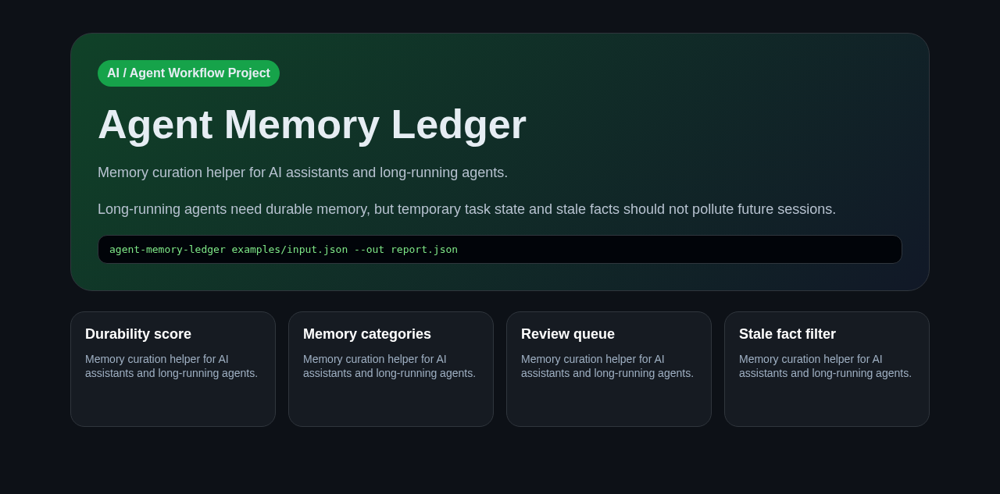

# Agent Memory Ledger

Memory curation helper for AI assistants and long-running agents.

## Why this is AI/agent related

Long-running agents need durable memory, but temporary task state and stale facts should not pollute future sessions. This project turns that workflow into structured JSON, deterministic reports, and a small CLI that can be used inside Codex, Claude Code, Hermes Agent, or another AI coding assistant loop.

## Features

- Classifies memory candidates
- Separates durable facts from task progress
- Produces memory review JSON
- Includes deletion/replacement suggestions

## Quick Start

```bash
python -m pip install -e .
agent-memory-ledger examples/input.json --out /tmp/agent-memory-ledger-report.json
```

## Demo

Open `docs/demo/index.html` for a visual proof dashboard.

## Submission description

See `docs/description.md`.

## Screenshot


